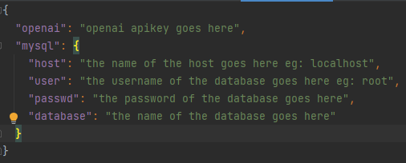

<div align="center">

# TeleSmart
![programming language][python]
![project status][status]
![chatbot][gpt]
![licence][licence]

</div>

Table of content,

* [introduction](#introduction)
* [prerequisites](#prerequisites)
* [Setup](#setup)
* [How to use](#how-to-use)
* [Maintenance](#maintenance)

## Introduction

TeleSmart will ask you a few questions regarding your interests of telescopes and using that information,

* Recommends you a telescope that best fits your interests from over 150 consumer telescopes,
* Explains to you the how the chosen telescope fits their interests,
* Provides an image of the telescope as well as some links to websites where the you can buy the telescope if you wish to.

![Project demo][demo]

> **Note**
> It usually takes around 15 seconds for the app to choose a telescope. the loading time was cut off to make the demo look cool

## Prerequisites

You need an **openai apikey** and have **mysql** downloaded and setup on your pc in order to run this project.
Make sure to **turn off your vpn** before running this project.
if you do not know how to do so then,

- [How to download mysql and set it up for the first time(for windows)](https://www.mysqltutorial.org/install-mysql/)
- [How to get an openai apikey](https://www.howtogeek.com/885918/how-to-get-an-openai-api-key/)
- [How to turn off vpn ;)](https://www.youtube.com/watch?v=dQw4w9WgXcQ)

## Setup


### 1.  Download this project

you can either clone this project by using, 
```sh
git clone https://github.com/BBCloverr/literate-giggle
```
or
download a zip file of it by clicking `code > download zip`

### 2. Download all the nessasary modules

to do so execute,
```sh
pip install -r requirements.txt
```

### 3. Create database

#### using your command line,

1. Login to mysql using,
   ```
   mysql -u root -p
   ```
> **important**
> Make sure to enter your mysql password after -p

3. Create a database using,
    ```
    CREATE database_name
    ```
4. Populate the database with the telescopes.sql by using,
    ```
    mysql -u username -p password database_name < telescopes.sql
    ```

#### using mysql workbench

1. connect to database.

2. go to on the top ribbon, click **server**.


3. then on the dropdown list, select **data import**.


4. on the popup, tick the **import from self contained file**. 


5. Put the path to the **telescopes.sql** into the box right next to it.


### 4. Populate the apikeys.json file

simply fill in the .json file with your infomation.



## How to use

* Open a command line in the directory where app.py is located and excecute,
    ```
    streamlit run app.py
    ```
* Then the app should open in a browser and you are good to go!

## Maintenance

* With the `update_database.py` script, you can ensure that the database containing the telescope data is up to date.

* To run `update_database.py`, open a command line in the project directory and type,
    ```
    python update_database.py
    ```
* if it worked correctly the following should popup


* now as the instructions above suggest, you can update your database.

> **Note**
> If you press 1, this script will add any new telescope it found to the database.
> If you press 2, this script will update the prices of all already existing telescopes.


[demo]: media/project%20demo2.gif
[licence]: https://img.shields.io/badge/licence-GNU_General_Public_License_v3.0-green
[python]: https://img.shields.io/badge/made_with-Python-blue?logo=python
[gpt]: https://img.shields.io/badge/GPT_3.5_Turbo-20b2aa?logo=openai
[status]: https://img.shields.io/badge/WIP-ffa500
